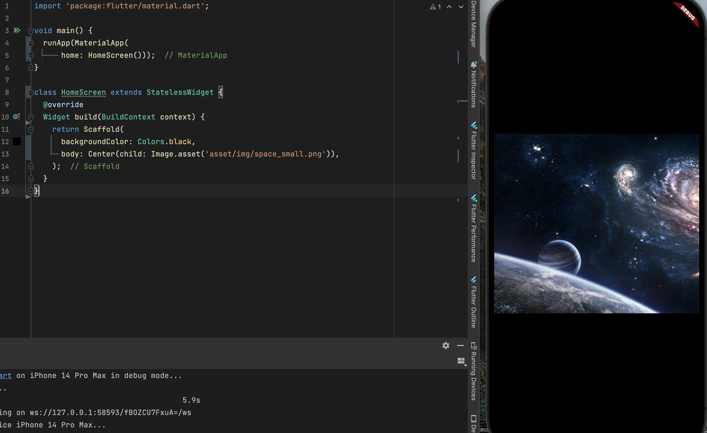

### Column Widget

화면에 이미지를 띄우고 Loading Indicator를 구현해 봅시다.

아래 예시에서 Indicator가 어떤 Widget인지 알더라도 `Image.asset() 밑에 넣을 수 있는 방법이 없습니다.

왜냐하면 Center Widget은 child에 하나의 파라미터 값만 받기 때문입니다.

그래서 Center Widget 말고 Volume Widget을 사용해 봅시다.



<br>

Column Widget은 세로로 정렬하는 기능이 있고, 반대로는 Row Widget이 있습니다.

Column은 Center 위젯과 다르게 여러개의 파라미터를 받으므로 `children`을 사용합니다.

**대부분의 위젯은 child 혹은 children을 가지고 있습니다.**

이제 Column Widget을 사용해봅시다.

```dart
void main() {
  runApp(MaterialApp(
      home: HomeScreen()));
}

class HomeScreen extends StatelessWidget {
  @override
  Widget build(BuildContext context) {
    return Scaffold(
      backgroundColor: Colors.black,
      body: Column(
        mainAxisAlignment: MainAxisAlignment.center,
        children: [
          Image.asset('asset/img/space_small.png'),
          CircularProgressIndicator(
            color: Colors.white,
          )
        ],
      ),
    );
  }
}
```

위 코드에서 Column의 파라미터인 `mainAxisAlignment`(주 축 정렬)를 사용한 이유는,

Column 위젯은 기본적으로 컨텐츠를 가장 위에 배치하기 때문에 주 축을 가운데오 고정 해줬습니다.

<br>

그 후 로딩 인디케이터인 `CircularProgressIndicator()`를 사용해줬고,

색깔도 배경이 검은색이기 때문에 로딩 인디케이터를 하얀색으로 바꿔보았습니다.

만약 배경색을 바꾸려면 Scaffold 밑에 backgroundColor를 바꿔주면 됩니다.

