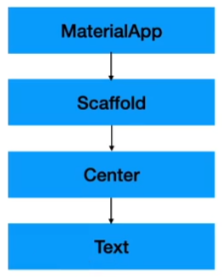
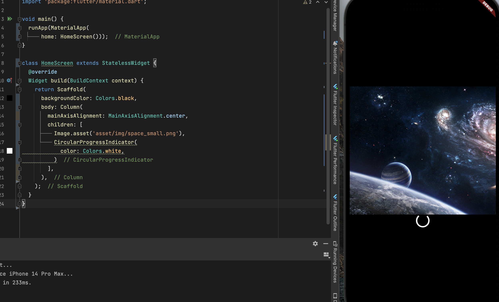

## Widget

**runApp()** : 플러터의 진입 포인트

**MaterialApp()** : 어플리케이션의 시작

**Scaffold()** : 화면 정의, backgorundColor : 화면의 배경색 정의

**Center()** : 컨텐츠의 중앙 위치

**Text()** : 텍스트, TextStyle : 말그대로 텍스트 스타일

```dart
import 'package:flutter/material.dart';

void main() {
  runApp(MaterialApp(
    /* Scaffold - 페이지 작성, 어플리케이션 화면 - Body */
    home: Scaffold(
      backgroundColor: Colors.black,
      body: Center(
          child: Text(
        'Hello World',
        style: TextStyle(color: Colors.white, fontSize: 20.0),
      )),
    ),
  ));
}
```

 

---

### **안드로이드 스튜디오에는 여러가지 버튼들이 있다.**

- **핫 리로드**는 가상 머신에 변경된 코드를 불러오고 위젯 트리를 재빌드한다. 이때 앱의 상태를 보존하기 때문에 `main()`이나 `initState()`를 재실행하지 않는다. (Intellij와 Android Studio에서는 ⌘\, VSCode에서는 ⌃F5)
- **핫 리스타트** 는 가상 머신에 변경된 코드를 불러오고 Flutter 앱을 재시작한다. 이때 앱의 상태는 잃어버린다. (Intellij와 Android Studio에서는 ⇧⌘\, VSCode에서는 ⇧⌘F5)
- **풀 리스타트**는 iOS, Android, Web 어플을 재시작한다. 이는 앞선 두가지보다 더 많은 시간을 필요로하는데 Java / Kotlin / ObjC / Swift 코드를 재 컴파일링 해야하기 때문이다. Web의 경우에는 Dart Development Compiler를 재시작하기까지 한다. 풀 리스타트에는 단축키는 따로 없어서 직접 앱을 멈췄다가 시작해야한다.

---

### Widget Tree

Widget이란 클래스의 일종이며, 위에서 봤던 Material, Scaffold, Center, Text 전부 위젯이다.

위젯 트리를 그려보면 아래와 같다.



---

## Splash Screen

- Asset 추가하기 (이미지)
- Stateless Widget 생성하기
- Column Widget
- Circular Progress Indicator Widget
- Image Widget (이미지를 띄우기 우한 위젯)

---

## Asset 추가하기

- 프로젝트 루트 경로에 asset - img 디렉터리 생성 후 이미지 삽입
- pubspec.yaml 파일 - flutter 하위에 assets를 추가한다.
- 그리고 만들어둔 이미지 폴더의 경로를 적어준다.
- 그 후 **상단에 Pub get 버튼을 꼭 눌러줘야 한다.**

```yaml
flutter:
  assets:
    - asset/img/
```

---

## Stateless Widget 생성하기

아래 코드는 지금은 간단하지만 코드가 복잡해지면 보기도 어려울 것이다.

그래서 Screen 단으로 분리를 해볼것이다.

```dart
void main() {
  runApp(MaterialApp(
    /* Scaffold - 페이지 작성, 어플리케이션 화면 - Body */
    home: Scaffold(
      backgroundColor: Colors.black,
      body: Center(
          child: Text(
        'Hello World',
        style: TextStyle(color: Colors.white, fontSize: 20.0),
      )),
    ),
  ));
}
```

**Stateless Widget 생성**

- 클래스에 `StatelessWidget`을 상속받아서 Widget을 반환하는 build() 함수를 오버라이딩 한다.
- 이렇게 사용하면 Hot Reload를 사용 가능한데, Hot Reload는 build 메서드 내의 코드만 실행시킨다.

```dart
import 'package:flutter/material.dart';

void main() {
  runApp(MaterialApp(
      /* Scaffold - 페이지 작성, 어플리케이션 화면 - Body */
      home: HomeScreen()));
}

class HomeScreen extends StatelessWidget {
  @override
  Widget build(BuildContext context) {
    return Scaffold(
      backgroundColor: Colors.black,
      body: Center(
        child: Text(
          'Hello World',
          style: TextStyle(color: Colors.white, fontSize: 20.0),
        ),
      ),
    );
  }
}
```

---

## Column Widget

화면에 이미지를 띄우고 Loading Indicator를 구현해보자.

아래 예시에서 Indicator가 어떤 Widget인지 알더라도 `Image.asset() 밑에 넣을 수 있는 방법이 없다.

왜냐하면 Center Widget은 child에 하나의 파라미터 값만 받기 때문이다.

그래서 Center Widget 말고 Volume Widget을 사용해보자.



<br>

Column Widget은 세로로 정렬하는 기능이 있고, 반대로는 Row Widget이 있다.

Column은 Center 위젯과 다르게 여러개의 파라미터를 받으므로 `children`을 사용한다.

**대부분의 위젯은 child 혹은 children을 가지고 있다.**

이제 Column Widget을 사용해보자.

```dart
void main() {
  runApp(MaterialApp(
      home: HomeScreen()));
}

class HomeScreen extends StatelessWidget {
  @override
  Widget build(BuildContext context) {
    return Scaffold(
      backgroundColor: Colors.black,
      body: Column(
        mainAxisAlignment: MainAxisAlignment.center,
        children: [
          Image.asset('asset/img/space_small.png'),
          CircularProgressIndicator(
            color: Colors.white,
          )
        ],
      ),
    );
  }
}
```

위 코드에서 Column의 파라미터인 `mainAxisAlignment`(주 축 정렬)를 사용한 이유는,

Column 위젯은 기본적으로 컨텐츠를 가장 위에 배치하기 때문에 주 축을 가운데오 고정해줬다.

그 후 로딩 인디케이터인 `CircularProgressIndicator()`를 사용해줬고,

색깔도 배경이 검은색이기 때문에 로딩 인디케이터를 하얀색으로 바꿔보았다.

만약 배경색을 바꾸려면 Scaffold 밑에 backgroundColor를 바꿔주면 된다.

