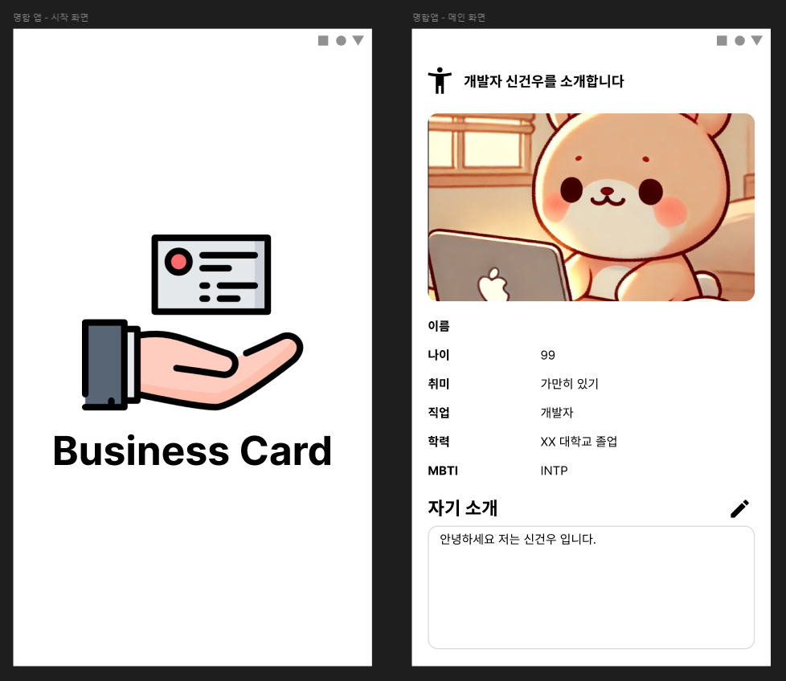

# Flutter

개발중인 크로스 플랫폼 사이드 프로젝트를 2024년 12월까지 출시 목표로 Flutter를 공부하는 Repository

 

⚒️ 개발 환경 설정

### Flutter SDK Setting

[Flutter SDK 설치](https://docs.flutter.dev/get-started/install)

- 환경변수 설정 필요
- cmd -> flutter docker 체크리스트 확인

 

### Android SDK & Studio Setting

[Android Studio 설치](https://developer.android.com/studio?hl=ko)

[Visual Studio Tools (C++) 설치](https://visualstudio.microsoft.com/ko/downloads)

1. **설치 후 SDK Manager에서 Andriod SDK, Android API 34 추가**
2. **SDK Tools에서 아래 Tool 설치**
- Android Command Line Tools
- NDK
- Android SDK Build-Tools
- Android Emulator
- Android SDK Platform-Tools
- Inter x86 Emulator Accelerator (HAXM installer)

3. **위 과정 전부 수행 후 cmd에 flutter-doctor 실행**
- 만약 `Android license status unknown` 에러가 뜬다면 `flutter doctor --android-licenses` 실행
- 만약 `CocoaPods not installed`가 에러가 뜬다면
4. **Dart, Flutter Plugin 설치**

 

### Emulator Setting

1. Flutter Project 생성
2. Tools - Device Manager - '+' 버튼(Create a new Device)
3. Pixel & PlayStore 마크가 있는 Device 선택 후 Next
4. UpsideDownCake 설치 후 설치된 Release를 선택 후 Next
5. AVD Name 정하고 하단 Show Advanced Settings 진입
6. Internal Storage Size를 적당히 변경(ex: 30GB) 후 Finish를 클릭해 Emulator 생성
7. (선택) Android Studio Setting - emulator 검색 - Launch in a tool window 체크 해제 (Emulator를 독립적인 창에서 실행)

 

### IntelliJ Flutter 개발 환경 세팅

- Settings - SDK 검색 - Edit 눌러 Android SDK 설치 (ANDROID_SDK_ROOT 변수도 같이 설정 - SDK 경로)
- Flutter Plugin 설치
- Flutter SDK 설치 및 환경변수 설정
- Settings - Flutter 검색 - SDK 경로 설정
- Dark SDK 경로 지정 -> `/flutter-SDK-경로/bin/cache/dart-sdk`
- `flutter config --android-sdk [Android SDK 경로]` 입력
- `flutter doctor` 실행
- Tools - Android - Device Manager - Device 생성

 

### Flutter Dependency

- `flutter pub add [패키지 이름]`

---

## 👨‍💻 학습 기록

**위젯**

- [📚 Stateless & Stateful Widget](Desc/Widget/State/Stateless-Stateful.md)
- [📚 Route - 경로 & 화면 매핑](./Desc/Widget/Route/Route.md)
- [📚 Column & Row & Expanded Widget](Desc/Widget/Row-Column-Expanded/Column-Row-Expanded.md)
- [📚 Container & SizeBox Widget](./Desc/Widget/Container-SizeBox/Container-SizeBox.md)
- [📚 Elevated Button & List View Widget](./Desc/Widget/ElevateButton-ListView/ElevatedButton-ListView.md)
- [📚 Text Field Widget(입력값 받기)](./Desc/Widget/TextField/TextField.md)

 

**상태 관리**

- [📚 setState - Update Widget & Re-draw UI](./Desc/State/SetState/SetState.md)
- [📚 Value Notifier - 더 간단하고 명확한 상태 관리](./Desc/State/Value-Notifier/Value-Notifier.md)

 

**Navigation & Routing**

- [📚 Navigating Screen & Argument(Object) 전달](./Desc/Navigation/Navigator-Object/Navigator-Object.md)
- [📚 Navigation Bar & TapBar & Drawer](./Desc/Navigation/Barr-Drawer/Bar-Drawer.md)

---

## 👨‍💻 명함 앱 만들기 프로젝트

Figma로 그려진 디자인을 1개의 Splash Screen(Stateless)과 Main Screen(Stateful)을 만들어 명함 앱 만들기

이미지의 size나 Figma 상 각 요소의 margin 값 등등은 Figma에 나오니 그 수치를 이용해 Widget을 만듭니다.

 

**주요 기능**

- 시작 화면 띄운 후 3초 뒤 메인화면으로 Navigation 전환 (pushReplacementNamed)
- 자기소개 란 입력값 저장 기능 (Shared Preferences로 상태 값 저장 및 Controller 활용)
  - 앱 실행 시 저장했던 데이터를 앱 종류 후 다시 재기동 했을떄도 저장된 데이터 불러오기 기능 (initState, SharedPreferences 활용)
- 입력된 값을 Toggle 방식으로 입력값 수정 기능 (GestureDetector 기능 활용)
  - 비활성화 시 입력 필드 Lock
  - 수정 버튼 클릭시 입력 필드 Lock 해제
  - 빈 값 입력하고 저장 시 저장 안되게 설정 후 SnackBar 메시지 보내기

 

- 시작 화면 코드 -> [Splash Screen](./lib/card/splash_screen.dart)
- 메인 화면 코드 -> [Main Screen](./lib/card/main_screen.dart)

---

## 👨‍💻 아이디어를 기록하는 노트 앱 만들기 프로젝트